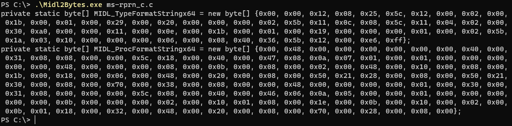
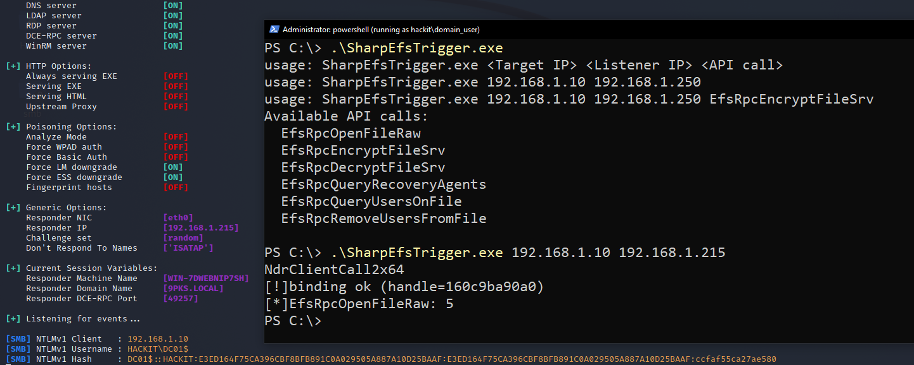
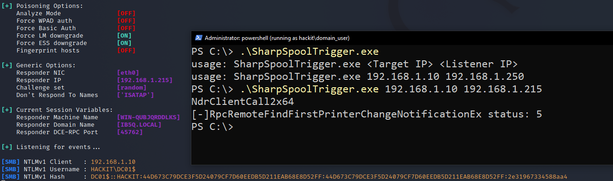
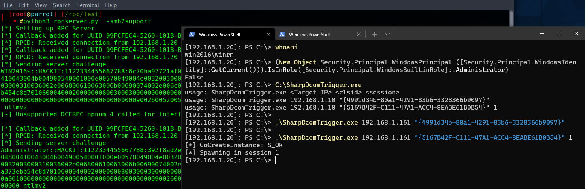

# SharpSystemTriggers

Collection of remote authentication triggers coded in C# using MIDL compiler for avoiding 3rd party dependencies.

## Midl2Bytes

For easy converting MIDL output to C# byte array.

One liner to get function call and call ID `(cat ms-rprn_c.c | sls '/* Procedure .* ' -Context 0,10) | foreach-object {$_.matches.value.replace(' Procedure ','') + " " + ($_.Context.PostContext | sls '^\/\*')[0].Line.Split()[1]}`

## SharpEfsTrigger

C# Implementation of MS-EFS RPC

## SharpSpoolTrigger

C# Implementation of MS-RPRN RPC

## SharpDcomTrigger

C# Implementation of DCOM Potato triggers

## Acknowledgements

* [PetitPotam](https://github.com/topotam/PetitPotam) by [topotam](https://twitter.com/topotam77)
* [SpoolSample](https://github.com/leechristensen/SpoolSample) by [Lee Christensen](http://twitter.com/tifkin_)
* [EfsPotato](https://github.com/zcgonvh/EfsPotato) by zcgonvh
* [pingcastle](https://github.com/vletoux/pingcastle) by [vletoux](https://twitter.com/mysmartlogon)
* All the potato devs

